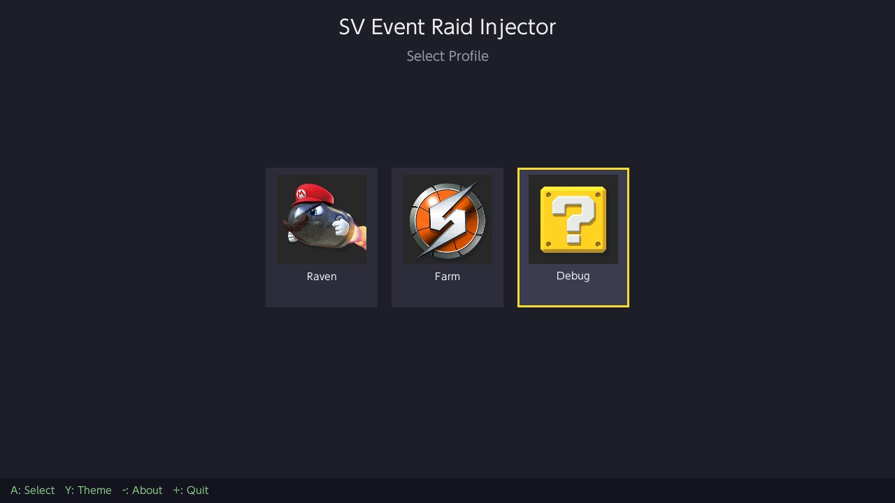
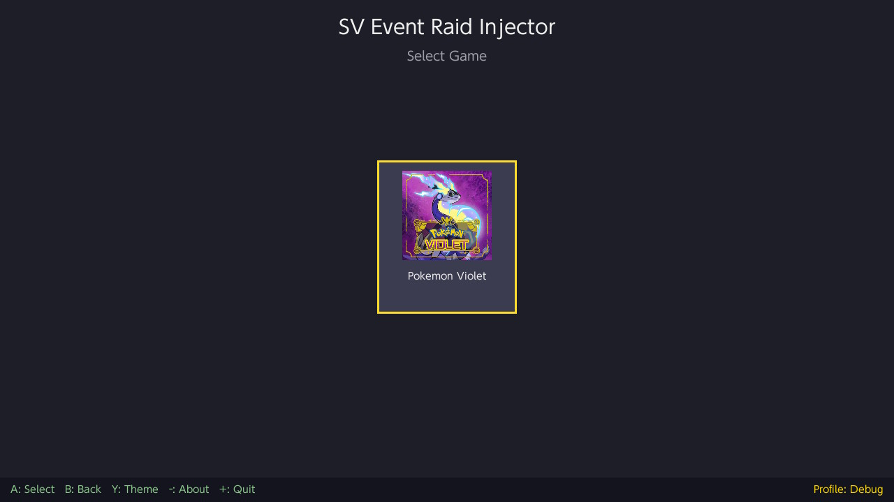
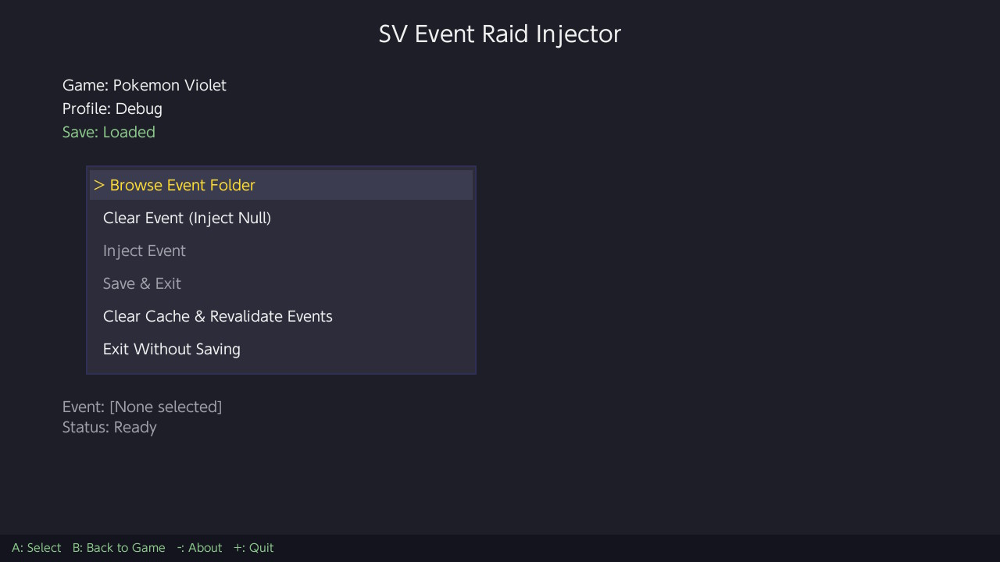
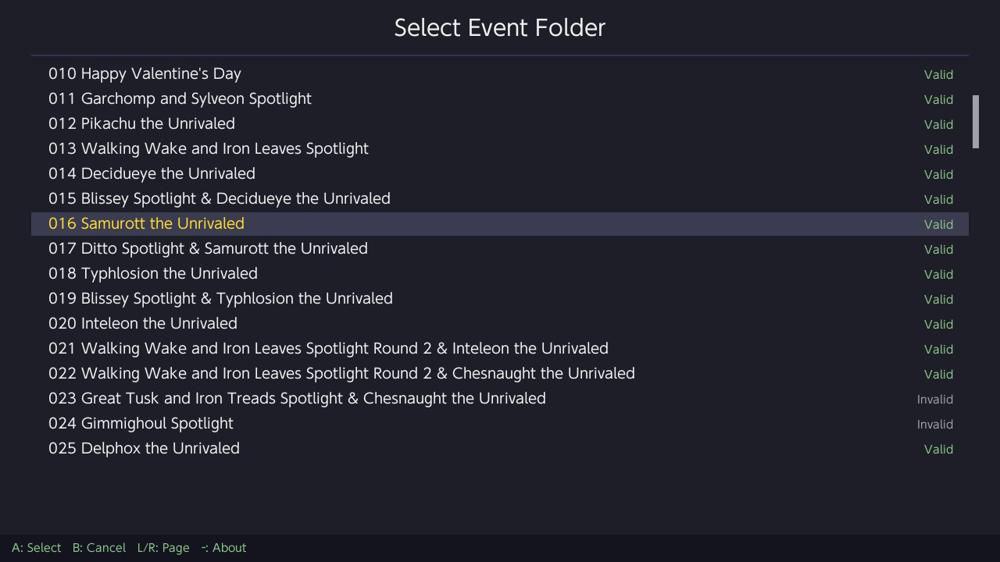
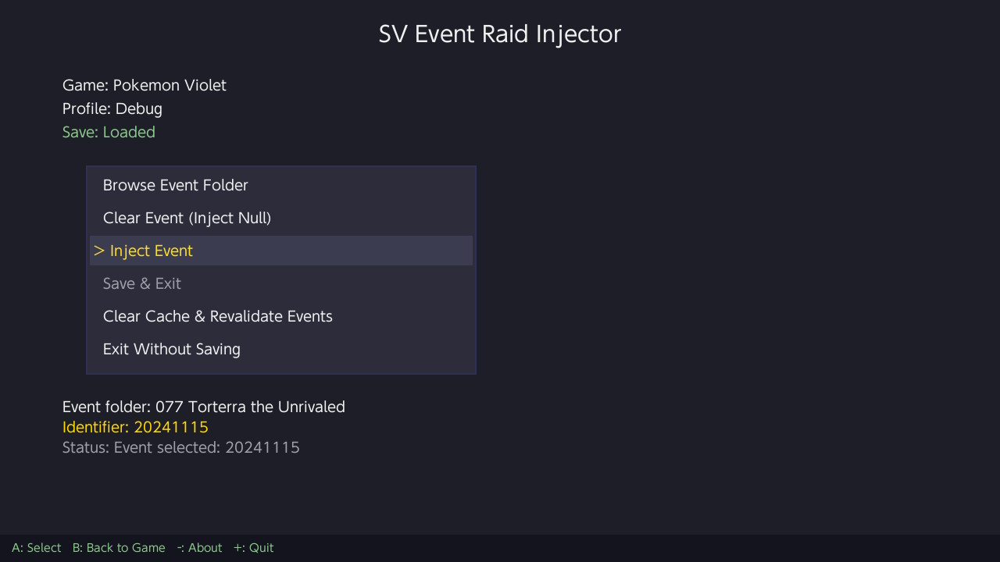
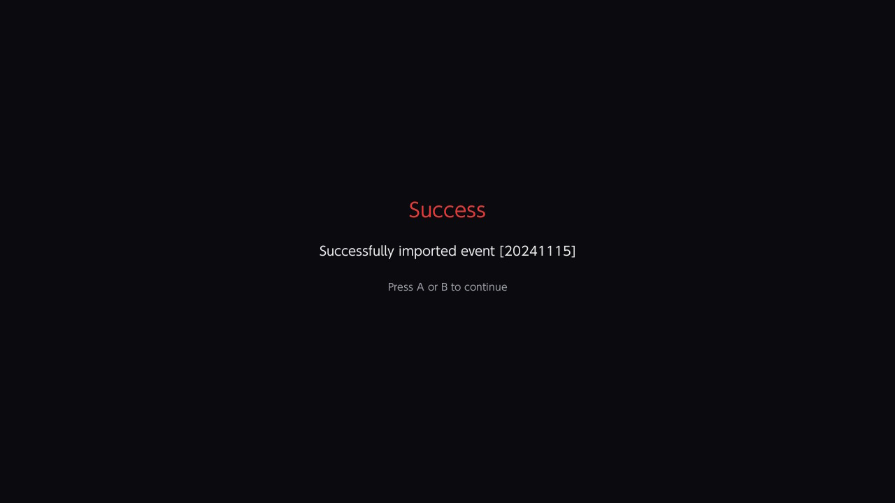

# Event Raid Injector

Inject Tera Raid and Mass Outbreak event data into Pokemon Scarlet & Violet save files directly on Nintendo Switch.

## Disclaimer

This software is provided "as-is" without any warranty.\
While the app has been tested, it may contain bugs that could corrupt or damage your save files.

**Use at your own risk.**

The author is not responsible for any data loss or damage to your save data.

This is why the automatic backup system exists — always verify your backups before making changes.

If you need to restore a backup, use a save manager such as [Checkpoint](https://github.com/FlagBrew/Checkpoint) or [JKSV](https://github.com/J-D-K/JKSV) to import the backup files back onto your Switch.

## Compatibility

- Scarlet / Violet version **4.0.0 only** !

## Features

- **Profile & Game Selection** — Pick any Switch user profile and choose between Scarlet or Violet
- **Raid Event Injection** — Inject Tera Raid event data from prepared event folders into your save file
- **Mass Outbreak Injection** — Inject Mass Outbreak event data (Paldea / Kitakami / Blueberry zones)
- **Combined Inject** — Stage a raid and an outbreak together; one Inject press commits both
- **Event Clearing** — Remove active raid or outbreak event data independently
- **Automatic Backups** — Save data is backed up to SD card before any modification
- **Round-Trip Verification** — Encryption integrity is verified after decryption to ensure data safety
- **Theme Support** — Switch between Default (dark) and HOME (light pastel) themes
- **Validity Cache** — Event folder validation results are cached to disk for instant browsing
- **Joystick & D-Pad Navigation** — Full analog stick support with repeat on all screens

## Requirements

- Nintendo Switch with CFW
- **Title override mode required** — Launch via a game title, not the album (applet mode is not supported)
- Pokemon Scarlet and/or Violet save data on the console
- SD card with sufficient free space for backups

## Installation

1. Copy `EventRaidInjector.nro` to `sdmc:/switch/EventRaidInjector/` on your SD card
2. Place raid event folders in `sdmc:/switch/EventRaidInjector/events/`
3. Place mass outbreak event folders in `sdmc:/switch/EventRaidInjector/outbreakevents/`
4. Launch via title override (hold R while opening a game)

## Raid Event Folder Structure

Each event folder placed in `events/` must contain:

```
MyRaidEvent/
  Identifier.txt              # Event name/description (first line is displayed)
  Files/
    event_raid_identifier      # 4 bytes
    raid_enemy_array           # 30,000 bytes
    fixed_reward_item_array    # 27,456 bytes
    lottery_reward_item_array  # 53,464 bytes
    raid_priority_array        # 88 bytes
```

Binary files support version suffixes (checked in order): `_3_0_0`, `_2_0_0`, `_1_3_0`, or no suffix.

Raid event data is available here: [ProjectPokemon — Raid Events](https://github.com/projectpokemon/EventsGallery/tree/master/Released/Gen%209/SV/Raid%20Events)

## Outbreak Event Folder Structure

Each event folder placed in `outbreakevents/` must contain:

```
MyOutbreakEvent/
  Identifier.txt              # Event name/description (first line is displayed)
  Files/
    pokedata_array_*           # 3,608 bytes — Pokémon list (required)
    zone_main_array_*          # 768 bytes  — Paldea zones (required)
    zone_su1_array_*           # 768 bytes  — Kitakami zones (required)
    zone_su2_array_3_0_0       # 768 bytes  — Blueberry zones (optional, 3.0.0+ only)
```

The `*` in filenames is a version suffix: `_3_0_0` for 3.0.0-era events, `_2_0_0` for 2.0.0-era events. The injector picks the newest available.

The Blueberry zone file is optional. Outbreak BCAT shipped in update 2.0.0 (Teal Mask), so 2.0.0-era events do not include `zone_su2_array`. If your save doesn't have the Indigo Disk DLC, the Blueberry block is skipped automatically.

Outbreak event data is available here: [ProjectPokemon — Outbreak Events](https://github.com/projectpokemon/EventsGallery/tree/master/Released/Gen%209/SV/Outbreak%20Events)

Both formats are compatible with [Tera-Finder](https://github.com/Manu098vm/Tera-Finder).

## Usage

1. **Select Profile** — Choose the Switch user profile with save data
2. **Select Game** — Pick Scarlet or Violet (a backup is created automatically)
3. **Browse Event Folder** *and/or* **Browse Outbreak Folder** — Select an event from each list (validity is shown for each folder)
4. **Inject Event** — Commits every staged selection (raid and/or outbreak) into the in-memory save
5. **Save & Exit** — Persist changes to disk and close the app

The right-side panel shows the staged state for each kind: `[Pending — press Inject]`, `[Injected]`, `[Cleared]`, or `[None selected]`.

### Combining raid and outbreak

You can stage both kinds before injecting:

1. Browse Event Folder → pick a raid → it appears in the panel as `[Pending]`
2. Browse Outbreak Folder → pick an outbreak → it appears in the panel as `[Pending]`
3. Press **Inject Event** once → both are written, both flip to `[Injected]`
4. **Save & Exit**

If only one slot is pending, only that one is injected; the other slot is left as-is.

### Clearing

- **Clear Event (Inject Null)** — Zeros all raid event blocks. Used to remove an active raid event.
- **Clear Outbreak Event (Inject Null)** — Zeros all outbreak event blocks while keeping the BCAT outbreak system enabled (matching Tera-Finder's null-event behavior).

Clearing is immediate (it writes directly to the in-memory save and marks it dirty); you don't need to press Inject after a Clear.

**Note:** After injecting a raid event, you may need to advance the system date by 1 day in-game to refresh the active raids. The same applies to outbreak rotations.

Use **Clear Cache & Revalidate Events** if you've added or modified event folders and need to refresh validation results. This clears the cache for both `events/` and `outbreakevents/`.

## Controls

| Screen | Action | Button |
|---|---|---|
| **Profile Selector** | Navigate | D-Pad Left/Right, Stick |
| | Select | A |
| | Theme | Y |
| | About | - |
| | Quit | + |
| **Game Selector** | Navigate | D-Pad Left/Right, Stick |
| | Select | A |
| | Back | B |
| | Theme | Y |
| | About | - |
| | Quit | + |
| **Main Menu** | Navigate | D-Pad Up/Down, Stick |
| | Select | A |
| | Back | B |
| | Theme | Y |
| | About | - |
| | Quit | + |
| **Folder Browser** | Navigate | D-Pad Up/Down, Stick |
| | Select | A |
| | Cancel | B |
| | Page Up/Down | L / R |
| | About | - |
| **Theme Selector** | Navigate | D-Pad Up/Down, Stick |
| | Confirm | A |
| | Cancel | B |

## Backups

Backups are created automatically in:

```
sdmc:/switch/EventRaidInjector/backups/{ProfileName}/{Game}/{ProfileName}_{Timestamp}/
```

If there isn't enough free space (2x save size), you'll be prompted to continue without a backup.

## Themes

- **Default** — Dark theme with gold and cyan accents
- **HOME** — Light pastel theme inspired by Pokemon HOME

Theme preference is saved to `theme.cfg` and persists across sessions.

## Screenshots

<div align="center">
    
    
    
    
    
    
</div>

## Credits

- **[Tera-Finder](https://github.com/Manu098vm/Tera-Finder)** by Manu098vm — Raid & outbreak injection logic and block definitions
- **[ProjectPokemon Events Gallery](https://github.com/projectpokemon/EventsGallery)** by ProjectPokemon — Event data source
- **[PKHeX](https://github.com/kwsch/PKHeX)** by kwsch — SCBlock format & encryption
- **[JKSV](https://github.com/J-D-K/JKSV)** by J-D-K — Save backup and write logic reference
- **[pkHouse](https://github.com/Insektaure/pkHouse)** by Insektaure — UI framework & Themes
- Built with [libnx](https://github.com/switchbrew/libnx) and [SDL2](https://www.libsdl.org/)
